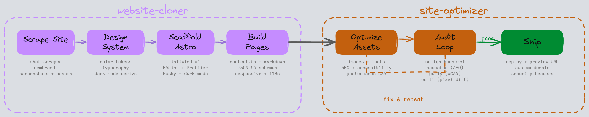

<p align="center">
  <h1 align="center">Web Smith</h1>
  <p align="center">
    <strong>Give it a URL. Get back Lighthouse 100.</strong>
  </p>
  <p align="center">
    <code>2 skills</code> &middot; <code>7 headless tools</code> &middot; <code>pixel-perfect diffs</code> &middot; <code>1680 lines of battle-tested process</code>
  </p>
</p>

<p align="center">
  <a href="https://astro.build"></a>
  <a href="https://tailwindcss.com"></a>
  <a href="https://pages.cloudflare.com"></a>
  <a href="https://claude.ai"></a>
</p>

<p align="center">
  
  
  
  
</p>

---

<p align="center">
  
</p>

---

## How It Works

### Clone a website

```
You:  "Clone example.com"

  1. Scrapes all pages    ── HTML, screenshots at 3 viewports, all assets
  2. Extracts design      ── colors, fonts, spacing, dark mode tokens
  3. Scaffolds project    ── Astro 6 + Tailwind v4 + ESLint + Husky
  4. Builds every page    ── content.ts, JSON-LD, dark mode, responsive
  5. Optimizes + audits   ── images, fonts, SEO, a11y, visual diffs
  6. Ships                ── Cloudflare Pages, preview URL, custom domain
```

### Optimize any existing site

```
You:  "Optimize this site for Lighthouse 100"

  1. Audits     ── unlighthouse-ci + seomator + pa11y
  2. Identifies  ── failing pages, categories, specific issues
  3. Fixes      ── images, fonts, meta, contrast, CLS, LCP
  4. Re-audits   ── repeat until 100/100/100/100
```

---

## 🔨 website-cloner

Scrape + rebuild a customer site as a high-performance Astro static site. Invokes `site-optimizer` at the end.

| Phase | What | Tools |
|---|---|---|
| Scrape | Pages, screenshots (3 viewports), HTML, assets, design tokens | `shot-scraper`, `dembrandt` |
| Design System | Semantic color tokens, dark mode derivation (OKLCH), `/design-system` page | -- |
| Scaffold | Astro 6 with full config (ESLint, Prettier, Husky, View Transitions, theme toggle) | `bun create astro` |
| Build Pages | `content.ts` + markdown, JSON-LD schemas, responsive, i18n-ready | Astro 6 |
| Optimize | Invokes `site-optimizer` | See below |

**Edge cases:** Cookie banner removal (13 selectors) -- SPA detection -- font licensing detection -- lazy-loaded content -- anti-bot guidance -- third-party embeds -- form backends -- dark mode image treatment -- i18n with `hreflang`

**Hard rules:**

```
Zero JS by default       Only <script is:inline> for theme + mobile menu
Dark mode always          Derive via OKLCH even if original has none
Responsive always         Even if original is not
Self-hosted fonts         Subset + WOFF2, never CDN
Content separated         content.ts or markdown, never hardcoded
Lighthouse 100            99+ after 200 attempts
```

---

## ⚡ site-optimizer

Framework-agnostic Lighthouse 100 optimization. Works on Astro, Next.js, Hugo, or any static site.

| Area | Covers |
|---|---|
| Images | Responsive `widths`/`sizes`, `fetchpriority` on LCP, lazy everything else |
| Fonts | `pyftsubset` to Latin WOFF2, variable fonts, `font-display: swap`, preload |
| SEO | Meta tags, Open Graph, Twitter, JSON-LD catalog (8 schema types) |
| Accessibility | Skip-to-content, `focus-visible`, `aria-current`, AAA contrast, `prefers-reduced-motion` |
| Performance CSS | Font smoothing, scrollbar styling, `::selection`, tap-highlight |
| Security | Headers reference for Cloudflare, Netlify, Vercel, Nginx, Apache |

**Audit tools (all headless):**

| Tool | What |
|---|---|
| `unlighthouse-ci` | Lighthouse per-page with budget thresholds |
| `seomator` | 251 SEO rules + AEO/GEO readiness |
| `pa11y` | WCAG accessibility via axe-core |
| `odiff` | Pixel-level image diff with percentage score |
| `magick compare` | Color extraction at exact pixel coordinates |
| `shot-scraper` | Element-level screenshots (`-s "nav"`, `-s "footer"`) |

**Visual comparison:** Element-level screenshot diffs per section (nav, hero, footer, full page). Percentage score. Exact color extraction at pixel coordinates. Specific feedback, not "looks different."

---

## Install

```bash
# Prerequisites
pip install shot-scraper && shot-scraper install
bun add -g dembrandt odiff-bin @seomator/seo-audit pa11y
brew install imagemagick

# Plugin
claude plugin marketplace add harryy2510/claude-toolkit
claude plugin install web-smith@claude-toolkit
```

Then in Claude Code:

```
You: "Clone example.com"
You: "Optimize this site for Lighthouse 100"
```

---

## Author

**Hariom Sharma** -- [github.com/harryy2510](https://github.com/harryy2510)

## License

MIT
